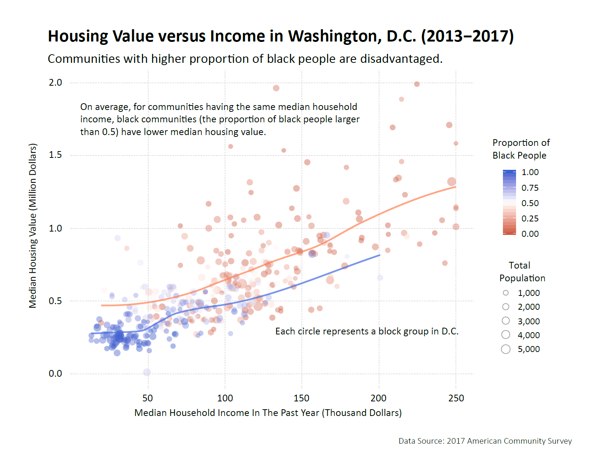
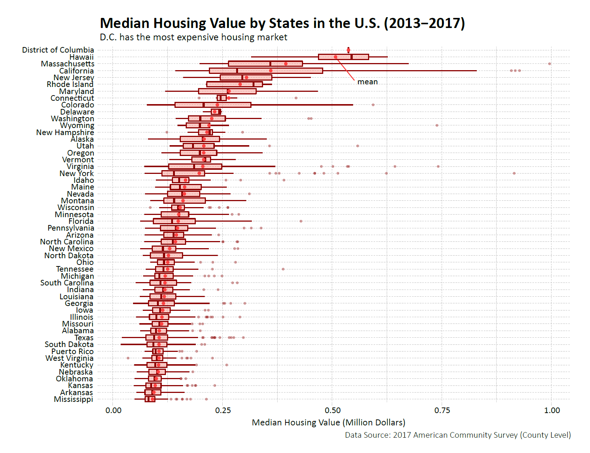

```{r setup, include = FALSE}
knitr::opts_chunk$set(echo = TRUE)
knitr::opts_chunk$set(message = FALSE)
knitr::opts_chunk$set(warning = FALSE)
```
*All the graphs have been modified in Adobe Illustrator.*

## Housing Value versus Income in Washington, D.C.

```{r 1, eval = FALSE}
library(ggplot2)
library(ggthemes)
library(dplyr)

options(scipen=10)

Black <- blck_grp_1317[["AHY2E003"]] / blck_grp_1317[["AHY2E001"]]
data_black <- filter(blck_grp_1317, Black >= 0.6)
data_white <- filter(blck_grp_1317, Black < 0.4)

ggplot(data = blck_grp_1317,
       mapping = aes(x = AH1PE001 / 1000,
                     y = AH53E001 / 1000000)) +
  geom_point(alpha = 0.45, aes(color = Black, size = AHY1E001)) +
  scale_color_gradient2(low = 'coral3', high = 'royalblue3', 
                        mid = 'white', midpoint = 0.5) +
  geom_smooth(data = data_black, color = 'royalblue', se = FALSE)+
  geom_smooth(data = data_white, color = 'coral', se = FALSE)+
  
  labs(x = "Median Household Income In The Past Year (Thousand Dollars)",
       y = "Median Housing Value (Million Dollars)",
       title = "Housing Value versus Income in Washington, D.C. (2013-2017)",
       subtitle = "Communities with higher proportion of black people are disadvantaged",
       caption = "Data Source: 2017 American Community Survey") +
  
  theme_pander(base_size = 16, base_family = "sans") +
  theme(plot.margin = unit(c(1,1,1,1), "cm"))
```



The dataset comes from the 2017 American Community Survey: 5-Year Data. The geographic level is block group and the data only covers DC area. If the dots are closer to blue, the area has higher proportion of black people. If the dots are closer to red, it is the opposite. From the graph, we can see communities with higher proportion of black people tend to have lower income and housing values.

## Median Housing Value by States in the U.S.

```{r 2, eval=FALSE}
library(ggplot2)
library(ggthemes)
library(extrafont)

mutate(STATE = fct_reorder(STATE, AH53E001, .fun='median'))

ggplot(data=county_1317, 
       aes(x=reorder(STATE, AH53E001),y=AH53E001/1000000)) + 
  geom_boxplot(outlier.colour="darkred",
               outlier.fill="darkred",
               outlier.size=1,
               alpha=0.4,
               color="darkred",
               fill="salmon",
               na.rm=TRUE)+
  stat_summary(fun.y=mean, geom="point", 
               size=1.5, color="brown1") +
  coord_flip() +
  
  labs(y = "Median Housing Value (Million Dollars)",
       x = "",
       title = "Median Housing Value across States in the U.S. (2013-2017)",
       subtitle = "D.C. has the most expensive housing market",
       caption = "Data Source: 2017 American Community Survey (County Level)") +
  
  theme_pander(base_size = 13) +
  theme(plot.margin = unit(c(1,1,1,1), "cm"))

```



The dataset comes from the 2017 American Community Survey: 5-Year Data. The geographic level is county and the data covers all the US area. The red points show the means of the distribution. The graph shows which state has relatively high or low median housing values. It also shows how dispersed or compact the distribution is in each state. From the graph, we can see that DC and Hawaii have the highest housing value, while Arkansas and Mississippi have the lowest.

## The Most Expensive Housing Markets In The U.S.

```{r 3, eval = FALSE}
library(ggplot2)
library(ggthemes)
library(viridis)
library(dplyr)

options(scipen = 10)
high <- c(6,8,11,15,24,25,34,36,41,49,51,53)
highvalue <- filter(state_1017, STATEA %in% high) %>%
  mutate(STATE2 = STATE)

highvalue %>%
  ggplot(aes(x = YEAR, y = JFJE001)) +
  geom_line(data = highvalue %>% dplyr::select(-STATE),
            aes(group=STATE2), color = "grey", 
            size = 0.5, alpha = 0.5)+
  geom_line(aes(group = STATE), color = "royalblue4", 
            size = 1.2)+
  scale_color_viridis(discrete = TRUE) +
  
  labs(x = "Year",
       y = "Median Housing Value (dollars)",
       title = "The Most Expensive Housing Markets In The U.S. (2010-2017)",
       subtitle = "Most of these housing markets boom since 2012. The median housing value in D.C. is rising rapidly, but this trend does not exist in its neighboring states Maryland and Virginia."),
       caption = "Data Source: American Community Survey (2010-2017)") +
  facet_wrap(~STATE) +
  
  theme(legend.position = "none") +
  theme_pander(base_size = 14, base_family = "sans")+
  theme(plot.margin = unit(c(1,1,1,1), "cm"))
```


The dataset comes from the American Community Survey from 2010 to 2017. The geographic level is state and the data covers all the U.S. area. The graph shows the top 12 states that have the highest housing value. Among these states, D.C.’s housing value is rising most rapidly but the housing value of Maryland and Virginia does not change a lot.

## The Housing Units by Year Built in Washington, D.C.

```{r 4, eval = FALSE}
library(tidyr)
library(ggplot2)
library(ggthemes)
library(dplyr)
library(ggpubr)

blck_grp1 <- mutate(blck_grp_1317, black = AHY2E003 / AHY2E001)
blck_grp2 <- arrange(blck_grp1, black)
blck_grp <- gather(blck_grp2, key=builtyear, value=units, 104:112)

a <- ggplot(data = blck_grp,
            aes(x = builtyear, y = units, fill = black)) +
  scale_fill_gradient2(low = 'darksalmon', 
                       high = 'darkseagreen3',
                       mid = 'white', midpoint=0.5) +
  labs(x = "Year Built")+
  scale_x_discrete(labels = c("~-1939", "1940-1949", "1950-1959", "1960-1969", "1970-1979", "1980-1989", "1990-1999", "2000-2009", "2010-2017"))+
  
  theme_pander(base_size = 15, base_family = "sans")+
  theme(plot.margin=unit(c(1,1,1,1),"cm"))

b <- a + 
  geom_bar(stat = "identity") +
  labs(title = "The Housing Units by Year Built in Washington, D.C. (Until 2017)",
       y="Housing Units",
       subtitle = paste("The color closer to blue represents a higher proportion of black people in the community. From the distribution, it is clear that the majority of black people's housing was built between 1940 and 1979, which shows less black people can afford new housing"))

c <- a +
  geom_bar(stat = "identity", position = "fill") +
  labs(y="Percentage",
       caption="Data Source: 2017 American Community Survey")+
  scale_y_continuous(labels = scales::percent)

ggarrange(b, c, ncol = 1, nrow = 2)
```


The dataset comes from the 2017 American Community Survey: 5-year data. The geographic level is block group and the data only covers D.C. area. The graph shows the building period of all the housing units in D.C. The color closer to green represents a higher proportion of black people in the community. The building year with the highest proportion of green areas is between 1940 and 1979, indicating most black people’s housing were built during that time. And the proportion is declining over the years, indicating less and less black people can afford new housing.

## The Population Structure of U.S. Most Expensive Housing Markets by Race

```{r 5, eval = FALSE}
library(ggplot2)
library(ggthemes)
library(dplyr)
library(tidyr)
library(ggpubr)

high <- c(6,8,11,15,24,25,34,36,41,49,51,53)
highvalue <- filter(population, STATEA %in% high)
POPULATION <- gather(highvalue, key = race, 
                     value = population, 32:35)

a <- ggplot(data = POPULATION, 
            aes(x = YEAR, y = population, fill = race)) +
  geom_area(position = "fill") +
  facet_wrap(~STATE) +
  labs(y = "Percentage") +
  scale_y_continuous(labels = scales::percent) +
  scale_fill_manual(name = NULL, 
                    values = c("mistyrose", "royalblue4", "lightskyblue1", "salmon")) +
  
  theme_pander(base_size = 12, base_family = "sans") +
  theme(plot.margin = unit(c(1,1,1,1), "cm"),
        axis.title.x = element_blank())

DC_M_V <- c(11,24,51)
DC_M_Vpop <- filter (population, STATEA %in% DC_M_V)
DC_M_VPOP <-gather (DC_M_Vpop, key=race, value=population, 32:35)

b <- ggplot(data = DC_M_VPOP, 
            aes(x = YEAR, y = population / 1000000, 
                fill = race)) +
  geom_area() +
  facet_wrap(~STATE, ncol = 1) +
  labs(y = "Population (Million People)") +
  scale_fill_manual(name = NULL, 
                    values = c("mistyrose", "royalblue4", "lightskyblue1", "salmon")) +
  
  theme_pander(base_size = 12, base_family = "sans") +
  theme(plot.margin = unit(c(1,1,1,1), "cm"),
        axis.title.x = element_blank())

c <- ggarrange(a, b, ncol = 2, nrow = 1,
               widths = c(2.3,1), common.legend = TRUE, 
               legend = "bottom")
annotate_figure(c, bottom = text_grob("Data Source: American Community Survey (2010-2017); US Decennial Census (1970-2010)", hjust=1, x = 1))
```


The dataset comes from the American Community Survey from 2010 to 2017 and the Decennial Census data from 1970 to 2010. The geographic level is state and the data covers all the US area. The graph on the left side shows the population composition of the 12 US states that have the highest housing value. Among these states, only the proportion of D.C.’s black population is declining. The proportions of “other races” in all the states are increasing, which indicates a more diverse society. The graph on the right side shows the three states’ population structure. It is possible that the black population moved from D.C. to Maryland and Virginia.

## Population Structure by Age in D.C.

```{r 6, eval = FALSE}
library(tidyr)
library(ggplot2)
library(ggthemes)
library(dplyr)
library(ggpubr)

DC10171 <- filter(DC_1017sex_age, YEAR %in% c(1990,2000,2010,2017))
DC1017 <- gather(DC10171, key = age, value = population, 6:27)

ggplot(DC1017, aes(x = age, y = population, fill = Gender)) + 
  geom_rect(aes(xmin = "IG4E010", xmax = "IG4E014", 
                ymin = -Inf, ymax = Inf),
            fill = "azure2", alpha = 0.2) +
  
  geom_bar(data = subset(DC1017, Gender == "Female"), 
           aes(y = -population), stat = "identity") + 
  geom_bar(data = subset(DC1017, Gender == "Male"),
           stat = "identity")+
  facet_wrap(~YEAR) +
  coord_flip() +
  
  scale_fill_manual(name = NULL, 
                    values = c("lightskyblue1", "burlywood1")) +
  scale_x_discrete(labels = c("0-4", "5-9", "10-14", "15-17", "18-19", "20", "21", "22-24", "25-29", "30-34", "35-39", "40-44", "45-49", "50-54", "55-59", "60-61", "62-64", "65-69", "70-74", "75-79", "80-84", "85+")) +
  scale_y_continuous(labels = abs) +
  
  theme_pander(base_size = 12) +
  theme(plot.margin = unit(c(1,1,1,1), "cm"),
        axis.title.y = element_blank(),
        axis.title.x = element_blank()) +
  
  labs(title = "Population Structure by Age in D.C. (1990-2017)",
       subtitle = "The sex ratio is well balanced and women tend to live longer than men. The population aged 20-40 is growing. More young people come to D.C. to look for working opportunities.",
       caption = "Data Source: 2017 American Community Survey; US Decennial Census (1990-2010)")

```


The dataset comes from the American Community Survey from 2010 to 2017 and the Decennial Census data from 1990 to 2010. The geographic level is state and the data only covers D.C. area. The graph shows the population composition by sex and age in 1990, 2000, 2010, and 2017. From the graph, we can see the sex ratio is well balanced and women tend to live longer than men. The population aged 25-40 is growing. The total population decreased from 1990 to 2000, and increased since 2000.

## The Change of Gini Index from 2010 to 2018 in The U.S.

```{r 7, eval = FALSE}
library(ggplot2)
library(tidyr)
library(dplyr)
library(ggthemes)
library(ggalt)
require(forcats)

gini2 <- mutate(gini, state = fct_reorder(STATE, gini_2018))

ggplot(gini2, aes(x = gini_2010, xend = gini_2018, y = state)) + 
  geom_dumbbell(size_x = 2, size_xend = 2, 
                colour = "darkgrey", colour_x = "salmon",
                colour_xend = "royalblue4") +
  theme_pander(base_size = 12, base_family = "sans") +
  theme(plot.margin = unit(c(1,1,1,1), "cm"),
        axis.title.y = element_blank()) +
  
  geom_text(color = "black", size = 3, hjust = -0.5,
            aes(x = gini_2018, label = gini_2018)) +
  geom_text(aes(x = gini_2010, label = gini_2010), 
            color = "black", size = 3, hjust = 1.5) +
  
  labs(x = "Gini Index",
       title = "The Gini Index Change From 2010 To 2018 In The U.S.",
       subtitle = "The Gini Index of most states have increased. The change in D.C. is the opposite but the Gini coefficient still remains at a very high level.",
       caption = "Data Source: American Community Survey (2010-2018)")

```


The dataset comes from the American Community Survey in 2010 and 2018. The geographic level is state and the data covers all the US area. The graph compares the Gini Index in 2010 and in 2018. The Gini Index of most states have increased. The change in D.C. is the opposite but the Gini coefficient still remains at a very high level.

## D.C. Minority Population Density Maps


The graph is produced in Tableau. The dataset comes from the American Community Survey from 2013 to 2017. The geographic level is block group and the data only covers D.C. area. The graph contains two maps. The map on the left shows the density of black population in D.C. and the one on the right shows the density of Hispanic or Latino population.
